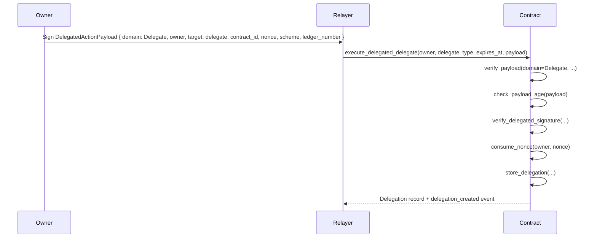

# Delegation Handbook for Downstream Integrators

This handbook covers the **CredenceDelegation** contract — the system that lets bond owners delegate attestation and management rights to other addresses using off-chain signatures. It is written for **downstream integrators** building front-ends, relayers, or indexers that interact with delegated operations.

---

## 1. Quick Reference

| Entrypoint | Caller | Purpose | Auth |
|------------|--------|---------|------|
| `delegate` | Owner | Create/replace a delegation directly | `owner.require_auth()` |
| `execute_delegated_delegate` | Relayer | Create a delegation via signed payload | `owner.require_auth()` + payload |
| `revoke_delegation` | Owner | Revoke a delegation directly | `owner.require_auth()` |
| `execute_delegated_revoke` | Relayer | Revoke a delegation via signed payload | `owner.require_auth()` + payload |
| `execute_delegated_revoke_attest` | Relayer | Revoke an attestation via signed payload | `attester.require_auth()` + payload |
| `is_valid_delegate` | Anyone (view) | Check if a delegate is currently valid | None |
| `get_delegation_summary` | Anyone (view) | Aggregated status for indexers | None |
| `cleanup_expired` | Anyone | Remove expired delegation from storage | None |
| `invalidate_nonce_range` | Owner | Emergency key recovery | `identity.require_auth()` |
| `get_nonce` | Anyone (view) | Read current nonce for an identity | None |

---

## 2. Delegation Model

### 2.1 Delegation Types

| Type | Purpose | Typical Delegate |
|------|---------|------------------|
| `Attestation` | Vouch for identity claims off-chain | Verifier, hot wallet |
| `Management` | Perform bond admin actions (`top_up`, `withdraw`, `slash`, etc.) | Treasury, hot wallet |

A delegation is **scoped to a single `(owner, delegate, DelegationType)` tuple**. Creating a new delegation of the same type overwrites the existing record.

### 2.2 Delegation Record

```rust
struct Delegation {
    owner: Address,
    delegate: Address,
    delegation_type: DelegationType,  // Attestation | Management
    expires_at: u64,                  // ledger timestamp (strictly > now)
    revoked: bool,                    // manual revocation flag
    revoked_at: u64,                  // ledger timestamp of revocation (0 = not revoked)
}
```

### 2.3 Validity Rules

A delegation is **valid** iff **all** hold:
1. Record exists in storage.
2. `revoked == false`.
3. `ledger.timestamp() < expires_at` (strict — equality means expired).

The `revocation_grace_period` (default 300 s, configurable by admin, `0` = unlimited) affects **audit status only** (`InGrace` vs `Expired`) and **late revocation eligibility** — it **does not** extend authority.

---

## 3. Restrictions & Bounds

### 3.1 Expiry Window

| Constraint | Value | Error |
|------------|-------|-------|
| Minimum `expires_at` | `now + 1` (strictly > current ledger timestamp) | `ExpiryInPast` (#500) |
| Maximum `expires_at` | `now + 365 days` (`MAX_DELEGATION_DURATION`) | `DelegationExpiryTooLong` (#503) |

> **Boundary enforcement**: `expires_at == now` is rejected. This prevents zero-duration delegations and makes the expiry check deterministic (no off-by-one at ledger boundaries).

### 3.2 Pause Gating

All mutating entrypoints are **paused-aware**:

- `delegate` / `execute_delegated_delegate`
- `revoke_delegation` / `execute_delegated_revoke` / `execute_delegated_revoke_attest`
- `invalidate_nonce_range`

When paused, these panic with `ContractPaused`. Query functions (`is_valid_delegate`, `get_delegation_summary`, `get_nonce`, etc.) remain available.

### 3.3 Payload Staleness Guard

Relayed payloads carry a `ledger_number` (Stellar ledger sequence at signing). The contract rejects payloads where:

```
current_ledger_sequence - payload.ledger_number > MAX_PAYLOAD_AGE_LEDGERS (200)
```

≈ 17 minutes at 5 s/ledger. This prevents an attacker from holding a signed payload and replaying it hours later.

**Ordering**: staleness check runs **after** domain/owner/target/contract binding but **before** nonce consumption — so a stale payload does **not** burn a nonce.

### 3.4 Domain Separation

Every relayed payload carries a `DomainTag`:

| Tag | Used by |
|-----|---------|
| `Delegate` | `execute_delegated_delegate` |
| `RevokeDelegation` | `execute_delegated_revoke` |
| `RevokeAttestation` | `execute_delegated_revoke_attest` |

A signature created for `Delegate` **cannot** be replayed against `RevokeDelegation` because the domain tag is bound into the signed hash. Mismatch panics with `DomainMismatch` (#504).

---

## 4. Revocation Flow

### 4.1 Direct Revocation (Owner-Signed)

```rust
// Owner calls directly
revoke_delegation(e, owner, delegate, DelegationType::Management, nonce)
revoke_attestation(e, attester, subject, nonce)
```

Flow:
1. `owner.require_auth()`
2. `consume_nonce(owner, nonce)` — fails with `InvalidNonce` if replayed
3. `mark_delegation_revoked` — sets `revoked = true`, `revoked_at = now`, emits `delegation_revoked`

### 4.2 Relayed Revocation (Signed Payload)

```rust
// Relayer submits signed payload
execute_delegated_revoke(e, owner, delegate, DelegationType::Management, payload)
execute_delegated_revoke_attest(e, attester, subject, payload)
```

**Validation order (security-critical):**
1. `verify_payload(payload, expected_domain, owner, target)` — domain/owner/target/contract binding
2. `check_payload_age(payload)` — staleness guard (before nonce burn)
3. `verify_delegated_signature(...)` — scheme dispatch
4. `consume_nonce(owner, payload.nonce)` — **nonce consumed here**
5. `mark_delegation_revoked(...)` — state transition

**Why this order matters:**
- A replayed payload fails at step 4 with `InvalidNonce` **even if the delegation was already revoked**.
- If step 5 ran before step 4, a replay could return `AlreadyRevoked` — leaking state through error ordering.

### 4.3 Late Revocation (Post-Expiry)

| Grace Period Config | Post-Expiry Revoke Allowed? |
|---------------------|-----------------------------|
| `revocation_grace_period = 0` (legacy) | Yes, forever |
| `revocation_grace_period = 300` (default) | Yes, until `expires_at + 300s` |
| `revocation_grace_period = N` | Yes, until `expires_at + N` |

> **Audit note**: An owner *can* revoke an already-expired delegation (within grace window). The record was already invalid (`is_valid_delegate == false`); revocation only flips `revoked_at` for explicit audit trail.

### 4.4 Cleanup (Storage Reclamation)

```rust
cleanup_expired(e, owner, delegate, DelegationType::Management)
```

- **Permissionless** — anyone can call.
- **Precondition**: `now >= expires_at` (strict).
- Removes the delegation from persistent storage and emits `delegation_cleaned`.
- Use this to reclaim storage rent after expiry.

---

## 5. Nonce Model & Key Recovery

### 5.1 Per-Identity Sequential Nonce

Every `Address` (owner/attester) has an independent monotonic `u64` counter stored at `DataKey::Nonce(identity)`.

- **Direct calls**: caller passes `nonce` explicitly; contract consumes it.
- **Relayed calls**: payload carries `nonce`; contract consumes it after domain/age checks.
- **Replay**: any payload with `nonce < current` → `InvalidNonce`.

### 5.2 Cross-Namespace Isolation

Nonces are **scoped to the delegation contract**. A payload signed for the bond contract's action namespace (`contract_id` mismatch) is rejected at `verify_payload` with `ContractIdMismatch` (#507) **before** the delegation nonce is touched.

### 5.3 Emergency Key Recovery

```rust
invalidate_nonce_range(e, identity, new_nonce)
```

- **Caller**: `identity` (owner of the compromised key).
- **Effect**: advances stored nonce to `new_nonce`, invalidating all payloads with `nonce < new_nonce`.
- **Bound**: `new_nonce - current_nonce <= 10_000` (`MAX_NONCE_INVALIDATION_SPAN`). Larger jumps require multiple calls.
- **Emits**: `nonce_invalidated` event with `(from_nonce, to_nonce)`.

Use case: private key compromise → owner calls `invalidate_nonce_range` → all pre-signed relay payloads become useless.

---

## 6. Integration Patterns

### 6.1 Creating a Delegation (Off-Chain Signing Flow)



**Off-chain payload construction** (pseudo-code):

```python
payload = DelegatedActionPayload(
    domain=DomainTag.Delegate,
    owner=owner_address,
    target=delegate_address,
    contract_id=delegation_contract_address,
    nonce=current_nonce,           # from get_nonce(owner)
    scheme=0,                      # 0 = Ed25519
    ledger_number=current_ledger   # from Horizon /ledgers/latest
)
signature = owner_private_key.sign(hash(payload))
# Relayer submits: execute_delegated_delegate(owner, delegate, type, expires_at, payload)
```

### 6.2 Checking Delegation Validity (On-Chain / Indexer)

```rust
// In another contract (e.g., bond contract)
fn execute_delegated_action(e: Env, owner: Address, delegate: Address) {
    // Single source of truth
    CredenceDelegationClient::new(&e, &delegation_contract)
        .check_delegation_active(&owner, &delegate, &DelegationType::Management);
    // ... proceed with action
}
```

```rust
// Indexer / read-only query
let summary = client.get_delegation_summary(&owner, &delegate, &DelegationType::Attestation);
// summary.is_valid == true  <=>  can act as delegate RIGHT NOW
```

### 6.3 Revoking via Relayer

```python
# Off-chain
payload = DelegatedActionPayload(
    domain=DomainTag.RevokeDelegation,
    owner=owner_address,
    target=delegate_address,
    contract_id=delegation_contract_address,
    nonce=current_nonce,
    scheme=0,
    ledger_number=current_ledger
)
signature = owner_private_key.sign(hash(payload))
# Relayer submits: execute_delegated_revoke(owner, delegate, type, payload)
```

### 6.4 Key Rotation / Compromise Recovery

```rust
// Owner detects key compromise
client.invalidate_nonce_range(&owner, &new_nonce);
// All payloads with nonce < new_nonce are now invalid.
// Owner can now create new delegations with fresh nonces.
```

---

## 7. Error Codes Reference (Wire-Stable)

| Code | Constant | Meaning |
|------|----------|---------|
| 500 | `ExpiryInPast` | `expires_at <= now` |
| 503 | `DelegationExpiryTooLong` | `expires_at > now + 365d` |
| 504 | `DomainMismatch` | Payload domain tag ≠ expected, or signature domain ≠ "CredenceDelegation" |
| 505 | `OwnerMismatch` | Payload `owner` ≠ call-site `owner` |
| 506 | `TargetMismatch` | Payload `target` ≠ call-site `delegate`/`subject` |
| 507 | `ContractIdMismatch` | Payload `contract_id` ≠ `e.current_contract_address()` |
| 508 | `PayloadTooOld` | `ledger.sequence - payload.ledger_number > 200` |
| 510 | `InvalidNonce` | Nonce already consumed / stale / out of order |
| 511 | `AlreadyRevoked` | Delegation/attestation already revoked |
| 512 | `DelegationNotFound` | No record for `(owner, delegate, type)` |
| 513 | `DelegationNotExpired` | `cleanup_expired` called before `expires_at` |
| 514 | `DelegationInactive` | `check_delegation_active` failed (revoked or expired) |
| 515 | `RevocationGraceExpired` | Post-expiry revoke attempted outside grace window |

> All codes are stable across upgrades — they are the on-chain `ContractError` discriminant.

---

## 8. Events for Indexers

| Event | Payload | When |
|-------|---------|------|
| `delegation_created` | `Delegation` | New delegation stored (direct or relayed) |
| `delegation_revoked` | `Delegation` | Delegation revoked (direct or relayed) |
| `delegation_cleaned` | `DelegationType` | Expired delegation removed from storage |
| `nonce_invalidated` | `(u64, u64)` | `invalidate_nonce_range` called (from_nonce, to_nonce) |
| `verifier_registered` | `(scheme, verifier_id, admin)` | Admin registers new signature scheme verifier |

All events use the contract's standard event topics (see `docs/EVENTS.md` for canonical schema).

---

## 9. Admin Operations

| Function | Caller | Effect |
|----------|--------|--------|
| `initialize(admin)` | — (once) | Sets admin, initializes pause state |
| `set_revocation_grace_period(admin, seconds)` | Admin | Configures post-expiry revoke window (`0` = unlimited, default `300`) |
| `get_revocation_grace_period()` | Anyone | Returns current grace period |
| `register_verifier(admin, scheme, verifier_id)` | Admin | Registers verifier contract for Secp256r1 / MLDSA44 |
| `get_verifier(scheme)` | Anyone | Returns registered verifier address |
| Pause / unpause | Admin or multi-sig | Gates all mutating entrypoints |

---

## 10. Build & Test Commands

```bash
# Build WASM for deployment
cargo build --target wasm32-unknown-unknown --release -p credence_delegation

# Run unit + integration tests
cargo test -p credence_delegation

# Lint (run before PR)
cargo clippy -p credence_delegation --all-targets -- -D warnings
cargo fmt --all -- --check
```

---

## 11. Related Documents

| Document | Audience | Link |
|----------|----------|------|
| Delegation API Reference | Integrator | [credence_delegation_api.md](credence_delegation_api.md) |
| Delegation System Overview | Integrator | [delegation.md](delegation.md) |
| Failure Mode Analysis | Contributor / Auditor | [delegation-failure-modes.md](delegation-failure-modes.md) |
| Event Catalog | Indexer | [EVENTS.md](EVENTS.md) |
| Error Code Wire Format | Integrator | [error-codes-wire.md](error-codes-wire.md) |
| Cross-Contract Trust Model | Auditor | [CROSS_CONTRACT_TRUST.md](CROSS_CONTRACT_TRUST.md) |

---

## 12. Quick Checklist for Integrators

- [ ] Query `get_nonce(owner)` before constructing any payload.
- [ ] Set `ledger_number` to **current ledger sequence** (not timestamp) at signing time.
- [ ] Use correct `DomainTag` for the target entrypoint.
- [ ] Include `contract_id = delegation_contract_address` in every payload.
- [ ] Handle `InvalidNonce` → retry with fresh nonce from `get_nonce`.
- [ ] Handle `PayloadTooOld` → re-sign with fresh `ledger_number`.
- [ ] Use `is_valid_delegate` / `check_delegation_active` for on-chain authorization checks.
- [ ] Listen for `delegation_revoked` and `nonce_invalidated` events to invalidate local cache.
- [ ] Test expiry boundary: `expires_at == now` must be **invalid**.
- [ ] Test pause: mutating calls must fail with `ContractPaused` when paused.